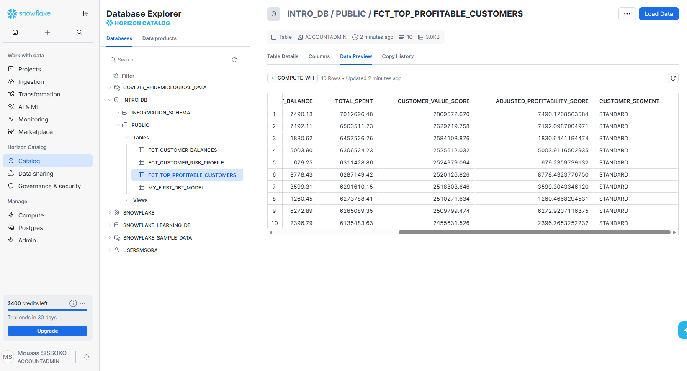
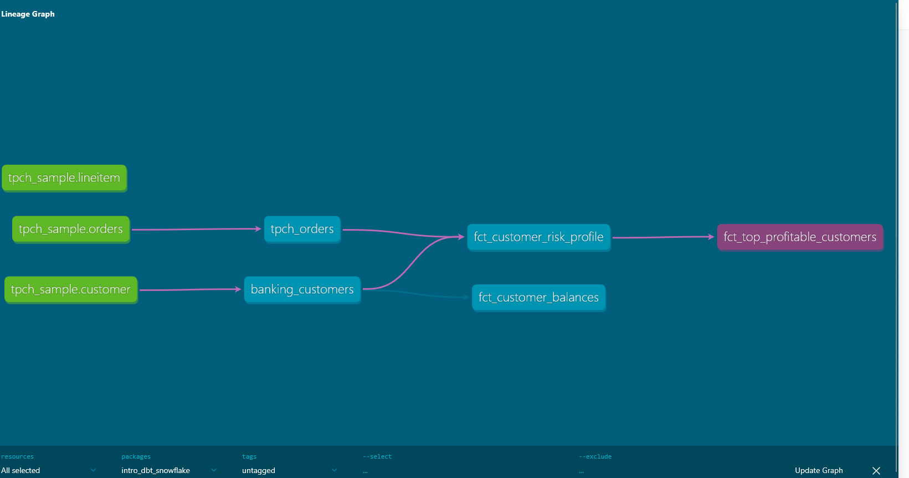

# 📊 Projet d'Analyse Bancaire (ELT) avec dbt & Snowflake

## 📝 Présentation du projet

Ce projet implémente un pipeline de données moderne basé sur l'architecture **ELT** (Extract, Load, Transform). L'objectif est de transformer des données bancaires brutes en indicateurs de performance (KPI) et en segments de risques exploitables pour une institution financière.

Contrairement à l'ETL classique, dbt nous permet de charger les données directement dans le Data Warehouse avant d'effectuer les transformations via SQL, optimisant ainsi la puissance de calcul de Snowflake.

## 🏗️ Concepts de Données

* **Data Lake** : Entrepôt de stockage brut pour tout type de données (vidéo, MP3, CSV, fichiers JSON).
* **Data Warehouse** : Entrepôt optimisé pour les données structurées et typées (variables, individus), stockant souvent des fichiers de type Parquet ou des tables SQL.
* **dbt Core** : Version open-source de dbt utilisée en local via le terminal pour orchestrer les transformations SQL.
* **ELT (Extract Load Transform)** : Approche consistant à charger les données brutes dans le warehouse, puis à effectuer la transformation directement à l'intérieur de celui-ci.

## 📂 Architecture du Pipeline

Le projet est structuré selon les meilleures pratiques d'Analytics Engineering :

1. **Staging** : Nettoyage, renommage des colonnes et typage des données brutes (matérialisé en **Vues** pour économiser le stockage).
2. **Marts** : Modélisation des règles métiers complexes (matérialisé en **Tables** pour la performance des rapports).
3. **Logic "Pro" (CTE)** : Utilisation systématique des blocs `WITH` pour découper le SQL en étapes logiques, facilitant la lecture et la maintenance.

## 🧪 Logique Financière & Scoring

Nous avons développé un modèle de scoring avancé (`fct_top_profitable_customers`) qui ne se contente pas d'additionner les montants, mais pondère les données pour une meilleure analyse du risque :

* **Score de Valeur** : Pondération entre le passé (dépenses cumulées) et le présent (solde actuel).
* **Ratio de Liquidité** : Ajustement de la rentabilité par le risque de solvabilité.
* **Segmentation métier** : Classification automatique des clients en catégories (`VIP_PROFITABLE`, `RISKY_SPENDER`, `STANDARD`) via des clauses `CASE WHEN`.





## 🚀 Installation et Utilisation

### 1. Installation de l'environnement

```bash
# Installation de dbt et de l'adaptateur spécifique à Snowflake
pip install dbt-core
pip install dbt-snowflake

```

### 2. Initialisation

```bash
dbt init  # Initialise le projet et configure les profils de connexion

```

### 3. Commandes principales

* **Exécution** : `dbt run` (Transforme les données et crée les tables/vues dans Snowflake).
* **Qualité** : `dbt test` (Vérifie l'intégrité : unicité, valeurs non nulles, règles métiers).
* **Documentation** :
```bash
dbt docs generate  # Génère le catalogue et le graphe de lignage
dbt docs serve --port 8001  # Lance le site web de documentation

```


---

### 💡 Conclusion

Ce projet démontre la capacité à transformer des données brutes en un produit de donnée fini, testé et documenté, prêt à être consommé par des outils de Business Intelligence (BI).

---
